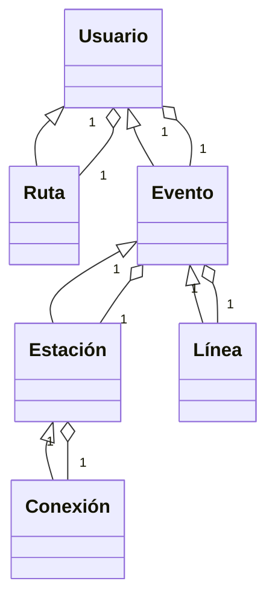

# Hackathon CANACINTRA 2024

## Problema

Existen muchos eventos al día a día que son imbredecibles o inesperados, esto incluye cuestiones climáticas, geográficas, sociales y  catastróficas. Para la población mexicana son frecuentes estos sucesos que afectan de forma colectiva como individual en materia de transporte, lo cual afecta en la pérdida de tiempo y dinero, repercutiendo en la economía necional, empresarial o individual.

## Reglas de negocio

Para esto hay que tener en cuenta lo siguiente:

Cada usuario cuenta con una serie de orígenes y destinos que suele repetir cotidianamente en horarios específicos. Estas rutas son comunes entre los usuarios. Existen orígenes y destinos que son mas comunes que otros. Del usuario debemos conocer su nombre de usuario, correo electrónico (para notificarlo de posibles contra tiempos), orígenes y destinos comunes.

El sistema de metro cuenta con diversas líneas que se conectan entre sí por medio de conexiones. Cada línea cuenta con una serie de estaciones. Cada estación tiene un tiempo de traslado a la siguiente estación. Cada línea tiene un tiempo de traslado entre estaciones.

El sistema de metro cuenta con una serie de eventos que pueden afectar el tiempo de traslado entre estaciones. Estos eventos pueden ser manifestaciones, problemas técnicos, etc. Cada evento tiene un tiempo de duración y una serie de estación afectadas, incluso toda la linea, además de una popularidad que indica la cantidad de personas que han notificado el evento.

Existen diferentes tipos de eventos, el tipo de evento asignado será un indicador del alcance del mismo, es decir: la magnitud de contratiempo que cause y su duración.

Los tipo de evento son:

- Cierre
- Avería
- Siniestro
- Congestión
- Manifestación
- Otro

El sistema debe notificar a los usuarios de posibles eventos que puedan afectar su tiempo de traslado. El sistema debe notificar a los usuarios de posibles rutas alternas que puedan tomar para llegar a su destino. Los usuarios pueden notificar de eventos que estén ocurriendo en el sistema de metro para que otros usuarios sean notificados a través de un sistema de popularidad. En caso de que los eventos sean públicos con anterioridad, el sistema debe notificar a los usuarios que comúnmente toman rutas que se vean afectadas por el evento.

## Requerimientos funcionales

- El sistema debe permitir a los usuarios registrarse
- El sistema debe permitir a los usuarios iniciar sesión
- El sistema debe permitir a los usuarios registrar sus rutas comunes.
- El sistema debe permitir a los usuarios notificar de eventos en el sistema de metro, una sola vez por evento.

## Requerimientos no funcionales

- El sistema debe obtener de forma automática rutas comunes de los usuarios a través de un algoritmo de predicción de rutas comunes.
- El sistema debe notificar a los usuarios de eventos en el sistema de metro que puedan afectar sus rutas comunes y mostrar rutas alternas.
- El sistema debe actualizar la información de contratiempos en tiempo real.

## Requerimientos de interfaz

- El sistema debe contar con una página web para que los usuarios puedan registrarse, iniciar sesión, registrar sus rutas comunes y notificar de eventos en el sistema de metro.
- El sistema debe contar con una página web para que los usuarios puedan ver las rutas alternas en caso de eventos en el sistema de metro.

## Entidades

- Usuario
- Ruta
- Evento
- Estación
- Línea
- Conexión

## Atributos

### Usuario

- Nombre de usuario
- Correo electrónico
- Rutas comunes
- Eventos notificados

### Ruta

- Origen
- Destino
- Tiempo de traslado estimado

### Evento

- Nombre
- Estaciones afectadas
- Línea afectada
- Tiempo de duración
- Popularidad (cantidad de votos)

### Estación

- Nombre
- Línea
- Ubicación

### Línea

- Nombre
- Estaciones
- Congestión

### Conexión

- Estación
- Lineas conectadas

## Relaciones

- Un usuario puede tener muchas rutas
- Una ruta puede ser de muchos usuarios

- Un usuario puede notificar muchos eventos
- Un evento puede ser notificado por muchos usuarios

- Un evento puede afectar a muchas estaciones
- Una estación puede ser afectada por muchos eventos

- Una estación pertenece a una línea
- Una línea tiene muchas estaciones

- Una conexión une a varias estaciones
- Una estación puede tener una conexión

## Diagrama de clases

## Requerimientos de Hackathon

### Preguntas amazon

#### ¿Quiénes son los usuarios? ¿Que sabe de ellos?

Son aquellos usuarios que frecuentan el sistema colectivo de transporte de la CDMX en específico del metro. Sabemos que buscan una facilidad de transporte efectivo, es decir, un transporte rápido, cómodo, seguro y económico.

#### ¿Cuál es el problema o la oportunidad predominante del cliente?

El problema se basa en la complejidad de los sucesos impredecibles que ocurren durante el transcurso del día en el sistema colectivo de transporte METRO, de manera específica en la ruta diaria del usuario de un punto a otro, impidiento el transporte efectivo y eficiente. Proponemos un método de notificación respecto a los eventos que puedan afectar la ruta común del usuario y sugerir una vía alternativa para el mismo buscando una experiencia personalizada para cada usuario de acuerdo a su rutina.

#### ¿Cuál es la solución y el beneficio más importante para el cliente?

Buscamos una implementación web que permita el libre manejo sobre la ruta diaría de un usuario-cliente. La aplicación tiene como objetivo prevenir y advertir sobre posibles sucesos dentro del sistema de transporte público del metro y con esto poder trazar una ruta más adaptatada a los eventos que impiden el libre transporte. Esto ayuda al cliente con información útil sobre los impedimentos en la ruta a seguir, con ayuda una vía alternativa lograremos reducir el tiempo gastado post-inconveniente.

#### ¿Cómo describimos la solución y la experiencia de los clientes?

Es una experiencia personalizada, específica y preventiva hacia un usuario, que busca reducir los efectos de un problema en la rutina diaría y la solución alternativa ante los problemas que enfrenta la población Mexicana en el día a día.

#### ¿Cómo probamos la solución con los clientes y medimos el éxito?

La idea principal es, de manera estadística, utilizar los datos del usuario para comparar la efectividad de las rutas alternativas propuestas con respecto al tiempo aprovechado contra el tiempo perdido en una ruta con impedimentos en el camino. De manera simultanea buscamos preguntar al cliente por medio de encuestas sobre la experiencia de la ruta alternativa.

### Palabras clave

#### PROBLEMÁTICA

Existen muchos eventos al día a día que son imbredecibles o inesperados, esto incluye cuestiones climáticas, geográficas, sociales y  catastróficas. Para la población mexicana son frecuentes estos sucesos que afectan de forma colectiva como individual en materia de transporte, lo cual afecta en la pérdida de tiempo y dinero, repercutiendo en la economía necional, empresarial o individual.

#### APLICABILIDAD

No existe una solución que notifique de forma preventiva sobre rutas comúnmente usadas.

#### ESCALABILIDAD

Esto puede escalar dependiendo del tipo de transporte y las ciudades en las que te mueves.

#### CREATIVIDAD

Mejorar la calidad de vida de las personas a través de la tecnología.

#### USO DE TECNOLOGÍA

Uso de algoritmos de predicción de rutas comunes y notificación de eventos en tiempo real. Uso de servicios de terceros para obtener información de eventos. Uso de servicios de terceros para obtener información de rutas. Uso de servicios de terceros para notificar a los usuarios.

## Tareas

- Scraping
    - Obtención de información de eventos
    - Obtención de información de rutas

- Interfaz
    - Página web
    - Despliegue de infraestructura

- Integración
    - Integración de servicios
    - Algoritmo de predicción de eventos
    - Algoritmo de rutas
    - Notificaciones

- Marketing
    - Encuestas
    - Publicidad
