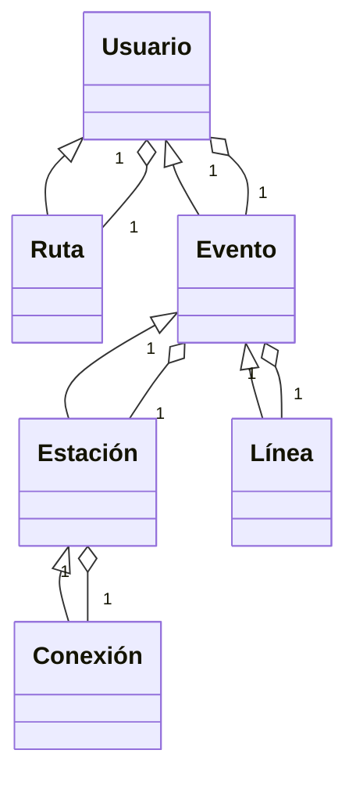

# Hackathon CANACITRA 2024

## Reglas de negocio

Existe una serie de usuarios que se traslada a través de distintos puntos de la ciudad. Estos usuarios tienen una serie de rutas comunes que realizan a diario. El tiempo de traslado de un punto a otro es variable y no siempre es posible predecirlo debido a las manifestaciones, problemas en el servicio de transporte, etc.

Cada usuario cuenta con una serie de orígenes y destinos que suele repetir cotidianamente en horarios específicos. Estas rutas son comunes entre los usuarios. Existen orígenes y destinos que son mas comunes que otros. Del usuario debemos conocer su nombre de usuario, correo electrónico (para notificarlo de posibles contra tiempos), orígenes y destinos comunes.

El sistema de metro cuenta con diversas líneas que se conectan entre sí por medio de conexiones. Cada línea cuenta con una serie de estaciones. Cada estación tiene un tiempo de traslado a la siguiente estación. Cada línea tiene un tiempo de traslado entre estaciones. Cada linea cuenta con un nivel de congestión que indica la cantidad de personas que se encuentran en la línea.

El sistema de metro cuenta con una serie de eventos que pueden afectar el tiempo de traslado entre estaciones. Estos eventos pueden ser manifestaciones, problemas técnicos, etc. Cada evento tiene un tiempo de duración y una serie de estación afectadas, incluso toda la linea, además de una popularidad que indica la cantidad de personas que han notificado el evento.

El sistema debe notificar a los usuarios de posibles eventos que puedan afectar su tiempo de traslado. El sistema debe notificar a los usuarios de posibles rutas alternas que puedan tomar para llegar a su destino. Los usuarios pueden notificar de eventos que estén ocurriendo en el sistema de metro para que otros usuarios sean notificados a través de un sistema de popularidad. En caso de que los eventos sean públicos con anterioridad, el sistema debe notificar a los usuarios que comúnmente toman rutas que se vean afectadas por el evento.

## Requerimientos funcionales

- El sistema debe permitir a los usuarios registrarse
- El sistema debe permitir a los usuarios iniciar sesión
- El sistema debe permitir a los usuarios registrar sus rutas comunes.
- El sistema debe permitir a los usuarios notificar de eventos en el sistema de metro, una sola vez por evento.

## Requerimientos no funcionales

- El sistema debe obtener de forma automática rutas comunes de los usuarios a través de un algoritmo de predicción de rutas comunes.
- El sistema debe notificar a los usuarios de eventos en el sistema de metro que puedan afectar sus rutas comunes y mostrar rutas alternas.
- El sistema debe actualizar la información de contratiempos en tiempo real.

## Requerimientos de interfaz

- El sistema debe contar con una página web para que los usuarios puedan registrarse, iniciar sesión, registrar sus rutas comunes y notificar de eventos en el sistema de metro.
- El sistema debe contar con una página web para que los usuarios puedan ver las rutas alternas en caso de eventos en el sistema de metro.

## Entidades

- Usuario
- Ruta
- Evento
- Estación
- Línea
- Conexión

## Atributos

### Usuario

- Nombre de usuario
- Correo electrónico
- Rutas comunes
- Eventos notificados

### Ruta

- Origen
- Destino
- Tiempo de traslado estimado

### Evento

- Nombre
- Estaciones afectadas
- Línea afectada
- Tiempo de duración
- Popularidad (cantidad de votos)

### Estación

- Nombre
- Línea
- Ubicación
- Congestión

### Línea

- Nombre
- Estaciones
- Congestión

### Conexión

- Estación
- Lineas conectadas

## Relaciones

- Un usuario puede tener muchas rutas
- Una ruta puede ser de muchos usuarios

- Un usuario puede notificar muchos eventos
- Un evento puede ser notificado por muchos usuarios

- Un evento puede afectar a muchas estaciones
- Una estación puede ser afectada por muchos eventos

- Una estación pertenece a una línea
- Una línea tiene muchas estaciones

- Una conexión une a varias estaciones
- Una estación puede tener una conexión

## Diagrama de clases

## Requerimientos de Hackathon

### Preguntas amazon

#### ¿Quiénes son los usuarios? ¿Que sabe de ellos?

Los usuarios son personas que se trasladan a través de la ciudad. Sabemos su nombre de usuario, correo electrónico, rutas comunes y eventos notificados.

#### ¿Cuál es el problema o la oportunidad predominante del cliente?

El problema predominante es que los usuarios no pueden predecir el tiempo de traslado de un punto a otro debido a eventos en el sistema de metro que no pueden predecir.

#### ¿Cuál es la solución y el beneficio más importante para el cliente?

La solución es notificar a los usuarios de eventos en el sistema de metro que puedan afectar sus rutas comunes y mostrar rutas alternas. El beneficio es que los usuarios puedan mejorar su tiempo de traslado evitando contratiempos en el sistema de metro.

#### ¿Cómo describimos la solución y la experiencia de los clientes?

La solución es un sistema que por medio de reportes tanto dentro del sistema como obtenidos a partir de otras fuentes pueda notificar a los usuarios de eventos en el sistema de metro que puedan afectar sus rutas comunes y mostrar rutas alternas.

#### ¿Cómo probamos la solución con los clientes y medimos el éxito?

La solución se puede probar con un grupo de usuarios que comúnmente se trasladan a través de la ciudad. El éxito se puede medir a través de la cantidad de eventos notificados por los usuarios y la cantidad de usuarios que han mejorado su tiempo de traslado. Se realizan encuestas a los usuarios para medir su satisfacción.

### Palabras clave

#### PROBLEMÁTICA

El transporte público es impredecible en sus tiempos a tal punto que no siempre es posible preparar una ruta que nos asegure el tiempo de traslado satisfactorio.

#### APLICABILIDAD

No existe una solución que notifique de forma preventiva sobre rutas comúnmente usadas.

#### ESCALABILIDAD

Esto puede escalar dependiendo del tipo de transporte y las ciudades en las que te mueves.

#### CREATIVIDAD

Mejorar la calidad de vida de las personas a través de la tecnología.

#### USO DE TECNOLOGÍA

Uso de algoritmos de predicción de rutas comunes y notificación de eventos en tiempo real. Uso de servicios de terceros para obtener información de eventos. Uso de servicios de terceros para obtener información de rutas. Uso de servicios de terceros para notificar a los usuarios.

## Tareas

- Scraping
    - Obtención de información de eventos
    - Obtención de información de rutas

- Interfaz
    - Página web
    - Despliegue de infraestructura

- Integración
    - Integración de servicios
    - Algoritmo de predicción de eventos
    - Algoritmo de rutas
    - Notificaciones

- Marketing
    - Encuestas
    - Publicidad
